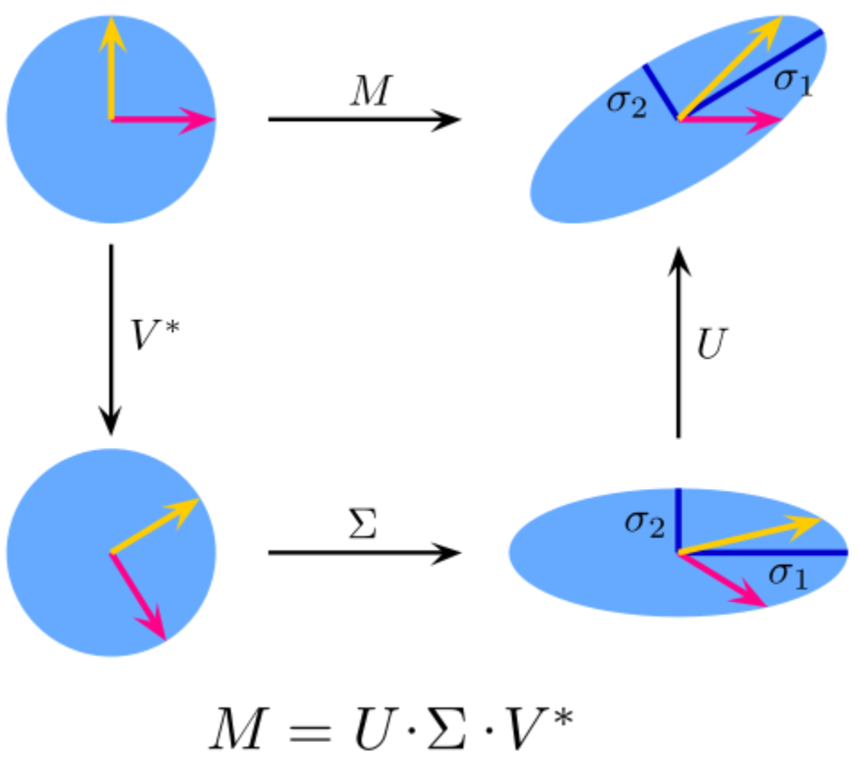

### Основні етапи SVD розкладу
**SVD** (сингулярний розклад матриці) подає матрицю у вигляді добутку трьох:
- U – ортогональна матриця m*m.
- S – діагональна матриця m*n.
- V – ортогональна матриця n*n.

**Алгоритм:**
1. **Обчислення сингулярних значень** - елементів діагоналі матриці S. Визначаються як квадратні корені власних значень матриць A^T\*A або A\*A^T.
3. **Обчислення матриць U і V**, що складаються з власних векторів матриць A\*A^T і A^T\*A відповідно.

### Застосування SVD до підбору рекомендацій
SVD розклад часто використовується в **системах рекомендацій**:
1. Побудова матриці рейтингів R.
2. SVD розклад матриці R.
3. Зменшення розмірності (перші k сингулярних значень).
4. Прогнозування рейтингів за апроксимованою R.

### Сфери застосування SVD
- **Обробка зображень**: зменшення розмірності, стиснення.
- **Системи рекомендацій**: персоналізовані рекомендації для користувачів.
- **Аналіз текстів**: пошук латентних семантичних відношень (LSA).
- **Аналіз даних**: зменшення розмірності, виявлення основних компонентів.

### Вплив вибору параметра \( k \) у SVD розкладі
- **Збільшення k**: краще наближення оригінальної матриці, але більші обчислювальні витрати і ризик перенавчання.
- **Зменшення k**: зменшення обчислювальних витрат, але може призвести до втрати важливої інформації.

### Переваги та недоліки SVD
**Переваги**:
- **Зменшення розмірності**: ефективне зменшення розмірності даних при збереженні їх основної структури.
- **Шумоподавлення**: видалення шуму та незначних компонентів з даних.
- **Універсальність**: застосування в різних сферах – від аналізу текстів до обробки зображень.

**Недоліки**:
- **Обчислювальна складність**: висока обчислювальна складність при обробці великих матриць.
- **Чутливість до вибору k**: емпіричний пошук балансу між точністю та обчислювальними витратами.
- **Інтерпретація**: важкість інтерпретації сингулярних векторів в деяких задачах.